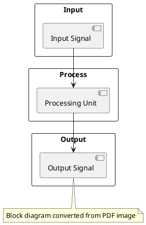

# Diagram Detection and PlantUML Conversion

This document describes the diagram detection and PlantUML conversion features added to the PDF to Markdown MCP server.

## Overview

The PDF to Markdown converter now includes the ability to:
1. Detect diagrams in PDF images 
2. Classify diagram types
3. Generate corresponding PlantUML code
4. Include PlantUML diagrams in the markdown output

## Configuration

Diagram detection is controlled by several environment variables:

```bash
# Enable/disable diagram detection
DETECT_DIAGRAMS=true

# Minimum confidence threshold (0.0-1.0)
DIAGRAM_CONFIDENCE=0.7

# PlantUML style (default, blueprint, modern)
PLANTUML_STYLE=default

# PlantUML color scheme (mono, color, auto)
PLANTUML_COLOR_SCHEME=auto
```

## Supported Diagram Types

The system can detect and generate PlantUML for:

- **FlowChart**: Process flow diagrams with decision points
- **BlockDiagram**: System architecture and signal flow diagrams  
- **CircuitDiagram**: Electronic circuit schematics
- **NetworkDiagram**: Network topology and infrastructure diagrams
- **SequenceDiagram**: Time-based interaction diagrams
- **ClassDiagram**: Object-oriented class relationships
- **ERDiagram**: Entity-relationship database diagrams

## Detection Method

Currently uses heuristic analysis based on:
- Image filenames and metadata
- Context within the PDF document
- Simple pattern recognition

Future enhancements could include:
- Computer vision analysis using OpenCV
- Machine learning-based diagram classification
- OCR text extraction for diagram labeling

## PlantUML Generation

For each detected diagram, the system generates appropriate PlantUML code:

### FlowChart Example
```plantuml
@startuml
' Flowchart detected from PDF diagram
start
:Process Input;
if (Condition?) then (yes)
  :Action A;
else (no)
  :Action B;
endif
:Generate Output;
stop

note bottom : Diagram converted from PDF image
@enduml
```

### Block Diagram Example


## Output Format

Detected diagrams are included in the markdown output as:

```markdown
### Detected Block Diagram (Confidence: 80.0%)

```plantuml
@startuml
' Block diagram detected from PDF
...
@enduml
```



*Original image: page_1_image_1.png*
```

## Usage

The diagram detection feature is automatically enabled when:
1. `DETECT_DIAGRAMS=true` in configuration
2. `EXTRACT_IMAGES=true` (images must be extracted first)
3. Images are found in the PDF

## API Integration

The feature integrates with the existing MCP tools:

- `convert_pdf_to_markdown`: Includes diagram detection in single file conversion
- `convert_pdfs_in_directory`: Processes diagrams across multiple PDFs

## Future Enhancements

Planned improvements include:

1. **Advanced Computer Vision**: Using OpenCV for contour detection, shape analysis, and feature extraction
2. **Machine Learning**: Training models on diagram datasets for better classification
3. **OCR Integration**: Extracting text from diagrams to improve PlantUML generation
4. **Interactive Editing**: Allowing manual refinement of detected diagrams
5. **Multiple Output Formats**: Supporting other diagram formats beyond PlantUML

## Performance Considerations

- Diagram detection adds minimal overhead with heuristic analysis
- Future computer vision features may require more processing time
- Large PDFs with many images may benefit from parallel processing

## Error Handling

The system gracefully handles:
- Images that cannot be analyzed
- Low confidence detections (below threshold)
- PlantUML generation errors
- Missing or corrupted image files

Failed diagram detection does not prevent PDF conversion from completing successfully.