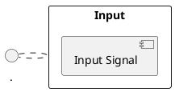

# Datasheet (PDF) to Markdown MCP Server

This is an MCP (Model Context Protocol) server optimized for converting hardware datasheet PDFs into structured Markdown files. It's designed to integrate with AI coding assistants and development workflows, making technical documentation more accessible and searchable. The server can process individual PDF files or batch process entire directories of PDFs.

## Features

- **PDF to Markdown Conversion**: Converts PDF files to structured Markdown with proper headers and formatting
- **Diagram Detection & PlantUML Generation**: Automatically detects diagrams in PDFs and generates PlantUML code
- **Batch Directory Processing**: Process all PDF files in a directory with a single command
- **Image Extraction**: Extracts and saves embedded images as PNG files
- **MCP Protocol Support**: Full compatibility with Model Context Protocol for AI assistant integration
- **Standard I/O Communication**: Uses stdio transport for reliable AI assistant integration
- **Configurable Processing**: Environment-based configuration for flexible deployment
- **Structured Output**: Generates organized directory structure with MARKDOWN_ prefix
- **Table of Contents**: Optional TOC generation for better navigation
- **Comprehensive Logging**: Detailed logging with configurable verbosity levels
- **Error Handling**: Robust error handling for batch processing with detailed reporting

## Installation

### Prerequisites

- **Windows**: Windows 10 or later (64-bit)
- **Mac**: macOS 10.15 (Catalina) or later (Intel or Apple Silicon)
- **Raspberry Pi**: Raspberry Pi OS (Debian-based) or Ubuntu 20.04+ (ARM64/ARM32)
- Git (for building from source)

### Option 1: Download Pre-built Binaries (Recommended)

Download the latest release for your platform from the [Releases page](https://github.com/your-repo/datasheet-to-md-mcp/releases):

#### Windows
1. Download `pdf-md-mcp-windows-amd64.zip`
2. Extract to a folder (e.g., `C:\Program Files\pdf-md-mcp\`)
3. Add the folder to your system PATH:
   - Press `Win + R`, type `sysdm.cpl`, press Enter
   - Click "Environment Variables"
   - Under "System Variables", find and select "Path", click "Edit"
   - Click "New" and add the path to your extracted folder
   - Click "OK" to save

#### Mac
1. Download `pdf-md-mcp-darwin-amd64.tar.gz` (Intel) or `pdf-md-mcp-darwin-arm64.tar.gz` (Apple Silicon)
2. Extract and install:
   ```bash
   # Intel Mac
   curl -L https://github.com/your-repo/datasheet-to-md-mcp/releases/latest/download/pdf-md-mcp-darwin-amd64.tar.gz | tar -xz
   
   # Apple Silicon Mac (M1/M2/M3)
   curl -L https://github.com/your-repo/datasheet-to-md-mcp/releases/latest/download/pdf-md-mcp-darwin-arm64.tar.gz | tar -xz
   
   # Make executable and move to PATH
   chmod +x pdf-md-mcp
   sudo mv pdf-md-mcp /usr/local/bin/
   ```

#### Raspberry Pi Linux
1. Download the appropriate binary:
   ```bash
   # For 64-bit Raspberry Pi OS
   wget https://github.com/your-repo/datasheet-to-md-mcp/releases/latest/download/pdf-md-mcp-linux-arm64.tar.gz
   tar -xzf pdf-md-mcp-linux-arm64.tar.gz
   
   # For 32-bit Raspberry Pi OS
   wget https://github.com/your-repo/datasheet-to-md-mcp/releases/latest/download/pdf-md-mcp-linux-arm.tar.gz
   tar -xzf pdf-md-mcp-linux-arm.tar.gz
   
   # Make executable and move to PATH
   chmod +x pdf-md-mcp
   sudo mv pdf-md-mcp /usr/local/bin/
   ```

### Option 2: Build from Source

#### Windows
1. Install Go 1.21 or later from [golang.org](https://golang.org/dl/)
2. Install Git from [git-scm.com](https://git-scm.com/download/win)
3. Open Command Prompt or PowerShell as Administrator:
   ```cmd
   git clone https://github.com/your-repo/datasheet-to-md-mcp.git
   cd datasheet-to-md-mcp
   go mod download
   go build -o pdf-md-mcp.exe .
   ```

4. **Add to PATH (Choose one method):**

   **Method A - Copy to System Directory (Recommended):**
   ```cmd
   # Copy the binary to a directory already in PATH
   copy pdf-md-mcp.exe "C:\Windows\System32\"
   ```

   **Method B - Add Project Directory to PATH:**
   ```cmd
   # Get current directory path
   echo %CD%
   
   # Add to system PATH permanently
   setx PATH "%PATH%;%CD%" /M
   
   # Or add to user PATH only (no admin required)
   setx PATH "%PATH%;%CD%"
   ```

   **Method C - Manual PATH Setup:**
   1. Right-click "This PC" → Properties → Advanced System Settings
   2. Click "Environment Variables"
   3. Under "System Variables" (or "User Variables"), find "Path"
   4. Click "Edit" → "New" → Add your project directory path
   5. Click "OK" to save all dialogs
   6. Restart Command Prompt/PowerShell

5. **Verify Installation:**
   ```cmd
   # Open a new Command Prompt and test
   pdf-md-mcp --version
   ```

#### Mac
1. Install Go using Homebrew (recommended):
   ```bash
   # Install Homebrew if not already installed
   /bin/bash -c "$(curl -fsSL https://raw.githubusercontent.com/Homebrew/install/HEAD/install.sh)"
   
   # Install Go
   brew install go
   
   # Clone and build
   git clone https://github.com/monamaret/datasheet-to-md-mcp.git
   cd datasheet-to-md-mcp
   make setup
   make build
   ```

2. **Add to PATH (Choose one method):**

   **Method A - Copy to /usr/local/bin (Recommended):**
   ```bash
   # Copy binary to standard location
   sudo cp ./bin/pdf-md-mcp /usr/local/bin/
   
   # Make executable (if needed)
   sudo chmod +x /usr/local/bin/pdf-md-mcp
   ```

   **Method B - Create Symlink:**
   ```bash
   # Create symbolic link in /usr/local/bin
   sudo ln -sf "$(pwd)/bin/pdf-md-mcp" /usr/local/bin/pdf-md-mcp
   ```

   **Method C - Add to Shell Profile:**
   ```bash
   # Add project bin directory to PATH in your shell profile
   echo 'export PATH="'$(pwd)'/bin:$PATH"' >> ~/.zshrc    # For zsh (default on macOS)
   echo 'export PATH="'$(pwd)'/bin:$PATH"' >> ~/.bash_profile  # For bash
   
   # Reload shell configuration
   source ~/.zshrc    # or source ~/.bash_profile
   ```

   **Method D - Manual PATH for Current Session:**
   ```bash
   # Temporary PATH addition (current terminal session only)
   export PATH="$(pwd)/bin:$PATH"
   ```

3. **Verify Installation:**
   ```bash
   # Test the installation
   pdf-md-mcp --version
   
   # Check which binary is being used
   which pdf-md-mcp
   ```

4. **macOS Security Notes:**
   - On first run, macOS may show a security warning
   - Go to System Preferences → Security & Privacy → Allow the app
   - Or use: `sudo xattr -r -d com.apple.quarantine /usr/local/bin/pdf-md-mcp`

#### Raspberry Pi Linux
1. Install Go and Git:
   ```bash
   # Update package manager
   sudo apt update
   
   # Install Git
   sudo apt install -y git
   
   # Install Go (latest version)
   sudo rm -rf /usr/local/go
   wget https://go.dev/dl/go1.21.5.linux-arm64.tar.gz  # Use arm for 32-bit
   sudo tar -C /usr/local -xzf go1.21.5.linux-arm64.tar.gz
   echo 'export PATH=$PATH:/usr/local/go/bin' >> ~/.bashrc
   source ~/.bashrc
   
   # Clone and build
   git clone https://github.com/your-repo/datasheet-to-md-mcp.git
   cd datasheet-to-md-mcp
   make setup
   make build
   ```

2. **Add to PATH (Choose one method):**

   **Method A - Copy to /usr/local/bin (Recommended):**
   ```bash
   # Copy binary to standard location
   sudo cp ./bin/pdf-md-mcp /usr/local/bin/
   
   # Make executable
   sudo chmod +x /usr/local/bin/pdf-md-mcp
   ```

   **Method B - Create Symlink:**
   ```bash
   # Create symbolic link in /usr/local/bin
   sudo ln -sf "$(pwd)/bin/pdf-md-mcp" /usr/local/bin/pdf-md-mcp
   ```

   **Method C - Add to Shell Profile:**
   ```bash
   # Add project bin directory to PATH
   echo 'export PATH="'$(pwd)'/bin:$PATH"' >> ~/.bashrc
   
   # Reload shell configuration
   source ~/.bashrc
   ```

   **Method D - System-wide Installation:**
   ```bash
   # For system-wide access (all users)
   sudo cp ./bin/pdf-md-mcp /usr/bin/
   sudo chmod +x /usr/bin/pdf-md-mcp
   ```

3. **Verify Installation:**
   ```bash
   # Test the installation
   pdf-md-mcp --version
   
   # Check which binary is being used
   which pdf-md-mcp
   
   # Check permissions
   ls -la $(which pdf-md-mcp)
   ```

4. **Raspberry Pi Specific Notes:**
   - Ensure you have sufficient disk space for the build process
   - Building may take longer on older Raspberry Pi models
   - Consider using a swap file if you encounter memory issues during compilation:
     ```bash
     sudo dphys-swapfile swapoff
     sudo nano /etc/dphys-swapfile  # Increase CONF_SWAPSIZE to 1024
     sudo dphys-swapfile setup
     sudo dphys-swapfile swapon
     ```

### Alternative Installation Methods

#### Using Go Install (All Platforms)
If you have Go installed and configured:
```bash
# Install directly from source
go install github.com/your-repo/datasheet-to-md-mcp@latest

# The binary will be available in $GOPATH/bin or $HOME/go/bin
# Make sure this directory is in your PATH:
export PATH=$PATH:$(go env GOPATH)/bin
```

#### Docker Installation (All Platforms)
```bash
# Build Docker image
docker build -t pdf-md-mcp .

# Run as container
docker run -v /path/to/pdfs:/input -v /path/to/output:/output pdf-md-mcp

# Create wrapper script for easier use
echo '#!/bin/bash
docker run -v "$PWD:/input" -v "$PWD/output:/output" pdf-md-mcp "$@"' > pdf-md-mcp
chmod +x pdf-md-mcp
sudo mv pdf-md-mcp /usr/local/bin/
```

## Configuration

### Quick Start Configuration

#### Windows
1. Create a configuration directory:
   ```cmd
   mkdir "%USERPROFILE%\pdf-md-mcp"
   cd "%USERPROFILE%\pdf-md-mcp"
   ```

2. Create a `.env` file in Notepad:
   ```cmd
   notepad .env
   ```

3. Add the following configuration (adjust paths as needed):
   ```env
   PDF_INPUT_DIR=C:\Users\%USERNAME%\Documents\PDFs
   OUTPUT_BASE_DIR=C:\Users\%USERNAME%\Documents\PDF-Output
   MCP_SERVER_NAME=pdf-to-markdown-server
   MCP_SERVER_VERSION=1.0.0
   IMAGE_MAX_DPI=300
   IMAGE_FORMAT=png
   PRESERVE_ASPECT_RATIO=true
   DETECT_DIAGRAMS=false
   INCLUDE_TOC=true
   BASE_HEADER_LEVEL=1
   EXTRACT_TABLES=true
   EXTRACT_IMAGES=true
   LOG_LEVEL=info
   ```

#### Mac
1. Create a configuration directory:
   ```bash
   mkdir -p ~/pdf-md-mcp
   cd ~/pdf-md-mcp
   ```

2. Create and edit the configuration file:
   ```bash
   nano .env
   ```

3. Add the following configuration:
   ```env
   PDF_INPUT_DIR=/Users/$USER/Documents/PDFs
   OUTPUT_BASE_DIR=/Users/$USER/Documents/PDF-Output
   MCP_SERVER_NAME=pdf-to-markdown-server
   MCP_SERVER_VERSION=1.0.0
   IMAGE_MAX_DPI=300
   IMAGE_FORMAT=png
   PRESERVE_ASPECT_RATIO=true
   DETECT_DIAGRAMS=false
   INCLUDE_TOC=true
   BASE_HEADER_LEVEL=1
   EXTRACT_TABLES=true
   EXTRACT_IMAGES=true
   LOG_LEVEL=info
   ```

#### Raspberry Pi Linux
1. Create a configuration directory:
   ```bash
   mkdir -p ~/pdf-md-mcp
   cd ~/pdf-md-mcp
   ```

2. Create and edit the configuration file:
   ```bash
   nano .env
   ```

3. Add the following configuration:
   ```env
   PDF_INPUT_DIR=/home/$USER/Documents/PDFs
   OUTPUT_BASE_DIR=/home/$USER/Documents/PDF-Output
   MCP_SERVER_NAME=pdf-to-markdown-server
   MCP_SERVER_VERSION=1.0.0
   IMAGE_MAX_DPI=200
   IMAGE_FORMAT=png
   PRESERVE_ASPECT_RATIO=true
   DETECT_DIAGRAMS=false
   INCLUDE_TOC=true
   BASE_HEADER_LEVEL=1
   EXTRACT_TABLES=true
   EXTRACT_IMAGES=true
   LOG_LEVEL=info
   ```

### Platform-Specific Considerations

#### Windows
- Use forward slashes (`/`) or double backslashes (`\\`) in paths
- Ensure PDF_INPUT_DIR and OUTPUT_BASE_DIR exist or will be created
- Windows Defender may need to whitelist the executable

#### Mac
- On first run, you may need to allow the executable in System Preferences > Security & Privacy
- For Apple Silicon Macs, ensure you download the ARM64 version
- Use absolute paths starting with `/Users/`

#### Raspberry Pi
- Reduce `IMAGE_MAX_DPI` to 200 or lower for better performance
- Consider using an external storage device for large PDF collections
- Monitor memory usage with `htop` during processing

### Testing Your Installation

Create test directories and run a quick test:

#### Windows
```cmd
mkdir "%USERPROFILE%\Documents\PDFs"
mkdir "%USERPROFILE%\Documents\PDF-Output"
pdf-md-mcp.exe --version
```

#### Mac/Linux
```bash
mkdir -p ~/Documents/PDFs
mkdir -p ~/Documents/PDF-Output
pdf-md-mcp --version
```

### Dependencies

The server uses the following Go modules:
- `github.com/joho/godotenv` - Environment variable management
- `github.com/ledongthuc/pdf` - PDF processing and text extraction
- `github.com/disintegration/imaging` - Image processing and manipulation

## Configuration

The server is configured using environment variables. Copy the example configuration file and customize it:

```bash
cp pdf_md_mcp.env .env
# Edit .env with your specific settings
```

### Configuration Options

| Variable | Description | Default |
|----------|-------------|---------|
| `PDF_INPUT_DIR` | Directory containing PDF files to process | Required |
| `OUTPUT_BASE_DIR` | Base output directory | `./output` |
| `MCP_SERVER_NAME` | Server identification name | `pdf-to-markdown-server` |
| `MCP_SERVER_VERSION` | Server version | `1.0.0` |
| `IMAGE_MAX_DPI` | Maximum image resolution (72-600) | `300` |
| `IMAGE_FORMAT` | Image output format (png/jpg) | `png` |
| `PRESERVE_ASPECT_RATIO` | Maintain image aspect ratios | `true` |
| `DETECT_DIAGRAMS` | Enable diagram detection and PlantUML generation | `false` |
| `DIAGRAM_CONFIDENCE` | Minimum confidence for diagram detection (0.0-1.0) | `0.7` |
| `PLANTUML_STYLE` | PlantUML diagram style (default/blueprint/modern) | `default` |
| `PLANTUML_COLOR_SCHEME` | PlantUML color scheme (mono/color/auto) | `auto` |
| `INCLUDE_TOC` | Generate table of contents | `true` |
| `BASE_HEADER_LEVEL` | Starting header level (1-6) | `1` |
| `EXTRACT_TABLES` | Enable table extraction | `true` |
| `EXTRACT_IMAGES` | Enable image extraction | `true` |
| `LOG_LEVEL` | Logging verbosity (debug/info/warn/error) | `info` |

## Usage

### As an MCP Server

The server runs as an MCP server using standard input/output for communication with AI coding assistants:

```bash
# Start the MCP server
./bin/pdf-md-mcp
```

### MCP Tool Usage

The server provides two main tools:

1. `convert_pdf_to_markdown` - Convert a single PDF file
2. `convert_pdfs_in_directory` - Convert all PDF files in a directory

**Single PDF File Conversion:**
- `pdf_path` (required): Path to the input PDF file
- `output_dir` (optional): Base output directory

**Directory Batch Conversion:**
- `input_dir` (required): Directory path containing PDF files to process
- `output_dir` (optional): Base output directory

**Example MCP tool calls:**
```json
{
  "name": "convert_pdf_to_markdown",
  "arguments": {
    "pdf_path": "/path/to/datasheet.pdf",
    "output_dir": "./output"
  }
}
```

```json
{
  "name": "convert_pdfs_in_directory",
  "arguments": {
    "input_dir": "/path/to/datasheets/",
    "output_dir": "./output"
  }
}
```

### Output Structure

The server creates a structured output directory:

```
output/
└── MARKDOWN_<filename>/
    ├── README.md          # Generated Markdown file
    ├── image_001.png      # Extracted images
    ├── image_002.png
    └── ...
```

### Diagram Detection Output

When diagram detection is enabled (`DETECT_DIAGRAMS=true`), the generated Markdown includes PlantUML diagrams:

```markdown
### Detected Block Diagram (Confidence: 80.0%)



*Original image: page_1_image_1.png*
```

For detailed information about diagram detection, see [DIAGRAM_DETECTION.md](DIAGRAM_DETECTION.md).

## Integration with AI Assistants

### Tabnine Enterprise Agent

Add to your Tabnine configuration:

```json
{
  "mcpServers": {
    "pdf-to-markdown": {
      "command": "/path/to/pdf-md-mcp",
      "args": [],
      "env": {
        "PDF_INPUT_DIR": "/path/to/your/datasheets/",
        "OUTPUT_BASE_DIR": "/path/to/output"
      }
    }
  }
}
```

### Claude Desktop

Add to your Claude Desktop configuration:

```json
{
  "mcpServers": {
    "pdf-to-markdown": {
      "command": "/path/to/pdf-md-mcp",
      "env": {
        "PDF_INPUT_DIR": "/path/to/your/datasheets/"
      }
    }
  }
}
```

## Development

### Building

```bash
# Build for current platform
make build

# Build for all platforms
make build-all

# Clean build artifacts
make clean
```

### Testing

```bash
# Run tests
make test

# Format code
make fmt

# Run linter (requires golangci-lint)
make lint
```

### Project Structure

```
.
├── main.go              # Main server entry point
├── config.go            # Configuration management
├── logger.go            # Structured logging
├── pdf_converter.go     # PDF processing engine
├── diagram_detector.go  # Diagram detection and PlantUML generation
├── mcp_handler.go       # MCP protocol implementation
├── go.mod               # Go module definition
├── pdf_md_mcp.env       # Example configuration
├── Makefile             # Build automation
├── README.md            # This file
└── DIAGRAM_DETECTION.md # Diagram detection documentation
```

## Function Documentation

All functions are thoroughly documented with detailed explanations:

- **Configuration Management**: Environment variable loading and validation
- **PDF Processing**: Text extraction, image processing, and content analysis
- **MCP Protocol**: Message handling and tool execution via stdio
- **Logging System**: Structured logging with configurable levels
- **Markdown Generation**: Content formatting and structure preservation

## Troubleshooting

### Common Issues

1. **PDF File Not Found**
   - Verify the `PDF_INPUT_DIR` is correct and accessible
   - Check file permissions

2. **Permission Errors**
   - Ensure the output directory is writable
   - Check that the server has read access to the PDF files

3. **Image Extraction Issues**
   - Some PDFs may have complex image formats
   - Try adjusting `IMAGE_MAX_DPI` setting
   - Check if `EXTRACT_IMAGES` is enabled

4. **MCP Communication Issues**
   - Ensure the AI assistant is properly configured to use stdio transport
   - Check that the server executable has proper permissions

### Logging

Increase log verbosity for debugging:

```bash
LOG_LEVEL=debug ./bin/pdf-md-mcp
```

### Performance Tuning

- Adjust `IMAGE_MAX_DPI` for balance between quality and file size
- Disable `EXTRACT_IMAGES` if images aren't needed for faster processing
- Use stdio transport for reliable communication with AI assistants

## Contributing

1. Fork the repository
2. Create a feature branch
3. Make your changes with proper documentation
4. Add tests for new functionality
5. Run `make fmt` and `make lint`
6. Submit a pull request

## License

[Add your license information here]