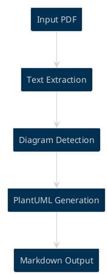

# Datasheet (PDF) to Markdown MCP Server

## Table of Contents
- [Features](#features)
- [Installation](#installation)
- [Configuration](#configuration)
  - [Quick Start Configuration](#quick-start-configuration)
  - [Platform-Specific Considerations](#platform-specific-considerations)
  - [Testing Your Installation](#testing-your-installation)
  - [Dependencies](#dependencies)
- [Configuration Management](#configuration-management)
  - [Configuration Options](#configuration-options)
  - [Config CLI](#config-cli)
  - [CLI Commands Reference](#cli-commands-reference)
- [Usage](#usage)
  - [As an MCP Server](#as-an-mcp-server)
  - [Command Line Interface](#command-line-interface)
  - [MCP Tool Usage](#mcp-tool-usage)
  - [Output Structure](#output-structure)
  - [Diagram Detection Output](#diagram-detection-output)
- [Integration with AI Assistants](#integration-with-ai-assistants)
  - [Tabnine Enterprise Agent](#tabnine-enterprise-agent)
- [Development](#development)
  - [Building](#building)
  - [Testing](#testing)
  - [Project Structure](#project-structure)

## Features

- **PDF to Markdown Conversion**: Converts PDF files to structured Markdown with proper headers and formatting
- **Diagram Detection & PlantUML Generation**: Automatically detects diagrams in PDFs and generates PlantUML code
- **Batch Directory Processing**: Process all PDF files in a directory with a single command
- **Image Extraction**: Extracts and saves embedded images as PNG files
- **MCP Protocol Support**: Full compatibility with Model Context Protocol for AI assistant integration
- **Standard I/O Communication**: Uses stdio transport for reliable AI assistant integration
- **Configurable Processing**: Environment-based configuration for flexible deployment
- **Structured Output**: Generates organized directory structure with MARKDOWN_ prefix
- **Table of Contents**: Optional TOC generation for better navigation
- **Comprehensive Logging**: Detailed logging with configurable verbosity levels
- **Error Handling**: Robust error handling for batch processing with detailed reporting

## Installation

Download the latest pre-built binary for your platform from the Releases page:

- https://github.com/monamaret/datasheet-to-md-mcp/releases

After downloading:
- Place the binary in a directory on your PATH (e.g., /usr/local/bin on macOS/Linux, or a PATH directory on Windows)
- Or run directly from the project's bin directory after building

For instructions on building from source, see the Development section below.

### Prerequisites

- **Windows**: Windows 10 or later (64-bit)
- **Mac**: macOS 10.15 (Catalina) or later (Intel or Apple Silicon)
- **Raspberry Pi**: Raspberry Pi OS (Debian-based) or Ubuntu 20.04+ (ARM64/ARM32)
- Git (for building from source)

### Option 1: Download Pre-built Binaries (Recommended)

Download the latest release for your platform from the [Releases page](https://github.com/monamaret/datasheet-to-md-mcp/releases):

#### Windows
1. Download `pdf-md-mcp-windows-amd64.zip`
2. Extract to a folder (e.g., `C:\Program Files\pdf-md-mcp\`)
3. Add the folder to your system PATH:
   - Press `Win + R`, type `sysdm.cpl`, press Enter
   - Click "Environment Variables"
   - Under "System Variables", find and select "Path", click "Edit"
   - Click "New" and add the path to your extracted folder
   - Click "OK" to save

#### Mac
1. Download `pdf-md-mcp-darwin-amd64.tar.gz` (Intel) or `pdf-md-mcp-darwin-arm64.tar.gz` (Apple Silicon)
2. Extract and install:
   ```bash
   # Intel Mac
   curl -L https://github.com/monamaret/datasheet-to-md-mcp/releases/latest/download/pdf-md-mcp-darwin-amd64.tar.gz | tar -xz
   
   # Apple Silicon Mac (M1/M2/M3)
   curl -L https://github.com/monamaret/datasheet-to-md-mcp/releases/latest/download/pdf-md-mcp-darwin-arm64.tar.gz | tar -xz
   
   # Make executable and move to PATH
   chmod +x pdf-md-mcp
   sudo mv pdf-md-mcp /usr/local/bin/
   ```

#### Raspberry Pi Linux
1. Download the appropriate binary:
   ```bash
   # For 64-bit Raspberry Pi OS
   wget https://github.com/monamaret/datasheet-to-md-mcp/releases/latest/download/pdf-md-mcp-linux-arm64.tar.gz
   tar -xzf pdf-md-mcp-linux-arm64.tar.gz
   
   # For 32-bit Raspberry Pi OS
   wget https://github.com/monamaret/datasheet-to-md-mcp/releases/latest/download/pdf-md-mcp-linux-arm.tar.gz
   tar -xzf pdf-md-mcp-linux-arm.tar.gz
   
   # Make executable and move to PATH
   chmod +x pdf-md-mcp
   sudo mv pdf-md-mcp /usr/local/bin/
   ```

### Option 2: Build from Source

#### Windows
1. Install Go 1.21 or later from [golang.org](https://golang.org/dl/)
2. Install Git from [git-scm.com](https://git-scm.com/download/win)
3. Open Command Prompt or PowerShell as Administrator:
   ```cmd
   git clone https://github.com/monamaret/datasheet-to-md-mcp.git
   cd datasheet-to-md-mcp
   go mod download
   go build -o pdf-md-mcp.exe .
   ```

4. **Add to PATH (Choose one method):**

   **Method A - Copy to System Directory (Recommended):**
   ```cmd
   # Copy the binary to a directory already in PATH
   copy pdf-md-mcp.exe "C:\Windows\System32\"
   ```

   **Method B - Add Project Directory to PATH:**
   ```cmd
   # Get current directory path
   echo %CD%
   
   # Add to system PATH permanently
   setx PATH "%PATH%;%CD%" /M
   
   # Or add to user PATH only (no admin required)
   setx PATH "%PATH%;%CD%"
   ```

   **Method C - Manual PATH Setup:**
   1. Right-click "This PC" → Properties → Advanced System Settings
   2. Click "Environment Variables"
   3. Under "System Variables" (or "User Variables"), find "Path"
   4. Click "Edit" → "New" → Add your project directory path
   5. Click "OK" to save all dialogs
   6. Restart Command Prompt/PowerShell

5. **Verify Installation:**
   ```cmd
   # Open a new Command Prompt and test
   pdf-md-mcp config help
   ```

#### Mac
1. Install Go using Homebrew (recommended):
   ```bash
   # Install Homebrew if not already installed
   /bin/bash -c "$(curl -fsSL https://raw.githubusercontent.com/Homebrew/install/HEAD/install.sh)"
   
   # Install Go
   brew install go
   
   # Clone and build
   git clone https://github.com/monamaret/datasheet-to-md-mcp.git
   cd datasheet-to-md-mcp
   make setup
   make build
   ```

2. **Add to PATH (Choose one method):**

   **Method A - Copy to /usr/local/bin (Recommended):**
   ```bash
   # Copy binary to standard location
   sudo cp ./bin/pdf-md-mcp /usr/local/bin/
   
   # Make executable (if needed)
   sudo chmod +x /usr/local/bin/pdf-md-mcp
   ```

   **Method B - Create Symlink:**
   ```bash
   # Create symbolic link in /usr/local/bin
   sudo ln -sf "$(pwd)/bin/pdf-md-mcp" /usr/local/bin/pdf-md-mcp
   ```

   **Method C - Add to Shell Profile:**
   ```bash
   # Add project bin directory to PATH in your shell profile
   echo 'export PATH="'$(pwd)'/bin:$PATH"' >> ~/.zshrc    # For zsh (default on macOS)
   echo 'export PATH="'$(pwd)'/bin:$PATH"' >> ~/.bash_profile  # For bash
   
   # Reload shell configuration
   source ~/.zshrc    # or source ~/.bash_profile
   ```

   **Method D - Manual PATH for Current Session:**
   ```bash
   # Temporary PATH addition (current terminal session only)
   export PATH="$(pwd)/bin:$PATH"
   ```

3. **Verify Installation:**
   ```bash
   # Test the installation
   pdf-md-mcp config help
   
   # Check which binary is being used
   which pdf-md-mcp
   
   # Check permissions
   ls -la $(which pdf-md-mcp)
   ```

4. **macOS Security Notes:**
   - On first run, macOS may show a security warning
   - Go to System Preferences → Security & Privacy → Allow the app
   - Or use: `sudo xattr -r -d com.apple.quarantine /usr/local/bin/pdf-md-mcp`

#### Raspberry Pi Linux
1. Install Go and Git:
   ```bash
   # Update package manager
   sudo apt update
   
   # Install Git
   sudo apt install -y git
   
   # Install Go (latest version)
   sudo rm -rf /usr/local/go
   wget https://go.dev/dl/go1.21.5.linux-arm64.tar.gz  # Use arm for 32-bit
   sudo tar -C /usr/local -xzf go1.21.5.linux-arm64.tar.gz
   echo 'export PATH=$PATH:/usr/local/go/bin' >> ~/.bashrc
   source ~/.bashrc
   
   # Clone and build
   git clone https://github.com/monamaret/datasheet-to-md-mcp.git
   cd datasheet-to-md-mcp
   make setup
   make build
   ```

2. **Add to PATH (Choose one method):**

   **Method A - Copy to /usr/local/bin (Recommended):**
   ```bash
   # Copy binary to standard location
   sudo cp ./bin/pdf-md-mcp /usr/local/bin/
   
   # Make executable
   sudo chmod +x /usr/local/bin/pdf-md-mcp
   ```

   **Method B - Create Symlink:**
   ```bash
   # Create symbolic link in /usr/local/bin
   sudo ln -sf "$(pwd)/bin/pdf-md-mcp" /usr/local/bin/pdf-md-mcp
   ```

   **Method C - Add to Shell Profile:**
   ```bash
   # Add project bin directory to PATH
   echo 'export PATH="'$(pwd)'/bin:$PATH"' >> ~/.bashrc
   
   # Reload shell configuration
   source ~/.bashrc
   ```

   **Method D - System-wide Installation:**
   ```bash
   # For system-wide access (all users)
   sudo cp ./bin/pdf-md-mcp /usr/bin/
   sudo chmod +x /usr/bin/pdf-md-mcp
   ```

3. **Verify Installation:**
   ```bash
   # Test the installation
   pdf-md-mcp --version
   
   # Check which binary is being used
   which pdf-md-mcp
   
   # Check permissions
   ls -la $(which pdf-md-mcp)
   ```

4. **Raspberry Pi Specific Notes:**
   - Ensure you have sufficient disk space for the build process
   - Building may take longer on older Raspberry Pi models
   - Consider using a swap file if you encounter memory issues during compilation:
     ```bash
     sudo dphys-swapfile swapoff
     sudo nano /etc/dphys-swapfile  # Increase CONF_SWAPSIZE to 1024
     sudo dphys-swapfile setup
     sudo dphys-swapfile swapon
     ```

### Alternative Installation Methods

#### Using Go Install (All Platforms)
If you have Go installed and configured:
```bash
# Install directly from source
go install github.com/monamaret/datasheet-to-md-mcp@latest

# The binary will be available in $GOPATH/bin or $HOME/go/bin
# Make sure this directory is in your PATH:
export PATH=$PATH:$(go env GOPATH)/bin
```

#### Docker Installation (All Platforms)
```bash
# Build Docker image
docker build -t pdf-md-mcp .

# Run as container
docker run -v /path/to/pdfs:/input -v /path/to/output:/output pdf-md-mcp

# Create wrapper script for easier use
echo '#!/bin/bash
docker run -v "$PWD:/input" -v "$PWD/output:/output" pdf-md-mcp "$@"' > pdf-md-mcp
chmod +x pdf-md-mcp
sudo mv pdf-md-mcp /usr/local/bin/
```

## Configuration

### Quick Start Configuration

#### Windows
```cmd
mkdir "%USERPROFILE%\pdf-md-mcp"
cd "%USERPROFILE%\pdf-md-mcp"
notepad .env
```

#### Mac
```bash
mkdir -p ~/pdf-md-mcp
cd ~/pdf-md-mcp
nano .env
```

#### Raspberry Pi Linux
```bash
mkdir -p ~/pdf-md-mcp
cd ~/pdf-md-mcp
nano .env
```

### Platform-Specific Considerations

#### Windows
- Use forward slashes (`/`) or double backslashes (`\\`) in paths
- Ensure PDF_INPUT_DIR and OUTPUT_BASE_DIR exist or will be created
- Windows Defender may need to whitelist the executable

#### Mac
- On first run, you may need to allow the executable in System Preferences > Security & Privacy
- For Apple Silicon Macs, ensure you download the ARM64 version
- Use absolute paths starting with `/Users/`

#### Raspberry Pi
- Reduce `IMAGE_MAX_DPI` to 200 or lower for better performance
- Consider using an external storage device for large PDF collections
- Monitor memory usage with `htop` during processing

### Testing Your Installation

Create test directories and run a quick test:

#### Windows
```cmd
mkdir "%USERPROFILE%\Documents\PDFs"
mkdir "%USERPROFILE%\Documents\PDF-Output"
pdf-md-mcp config help
```

#### Mac/Linux
```bash
mkdir -p ~/Documents/PDFs
mkdir -p ~/Documents/PDF-Output
pdf-md-mcp config help
```

### Dependencies

The server uses the following Go modules:
- `github.com/joho/godotenv` - Environment variable management
- `github.com/ledongthuc/pdf` - PDF processing and text extraction
- `github.com/disintegration/imaging` - Image processing and manipulation

## Configuration Management

The server is configured using environment variables. The built-in Config CLI provides a convenient way to manage configuration files without needing external tools.

### Configuration Options

| Variable | Description | Default |
|----------|-------------|---------|
| `PDF_INPUT_DIR` | Directory containing PDF files to process | Required |
| `OUTPUT_BASE_DIR` | Base output directory | `./output` |
| `MCP_SERVER_NAME` | Server identification name | `pdf-to-markdown-server` |
| `MCP_SERVER_VERSION` | Server version | `1.0.0` |
| `IMAGE_MAX_DPI` | Maximum image resolution (72-600) | `300` |
| `IMAGE_FORMAT` | Image output format (png/jpg) | `png` |
| `PRESERVE_ASPECT_RATIO` | Maintain image aspect ratios | `true` |
| `DETECT_DIAGRAMS` | Enable diagram detection and PlantUML generation | `false` |
| `DIAGRAM_CONFIDENCE` | Minimum confidence for diagram detection (0.0-1.0) | `0.7` |
| `PLANTUML_STYLE` | PlantUML diagram style (default/blueprint/modern) | `default` |
| `PLANTUML_COLOR_SCHEME` | PlantUML color scheme (mono/color/auto) | `auto` |
| `INCLUDE_TOC` | Generate table of contents | `true` |
| `BASE_HEADER_LEVEL` | Starting header level (1-6) | `1` |
| `EXTRACT_TABLES` | Enable table extraction | `true` |
| `EXTRACT_IMAGES` | Enable image extraction | `true` |
| `LOG_LEVEL` | Logging verbosity (debug/info/warn/error) | `info` |
| `MCP_TRANSPORT` | Transport method for MCP communication | `stdio` |

### Config CLI

The server includes a built-in configuration CLI that helps you generate, view, and modify configuration files:

```bash
# Show all available commands
pdf-md-mcp config help

# Create a new .env file with default values
pdf-md-mcp config generate

# Create config at a specific location
pdf-md-mcp config create /path/to/my-config.env

# Force overwrite existing config
pdf-md-mcp config create /path/to/my-config.env --force

# View current configuration (from .env)
pdf-md-mcp config show

# View configuration from specific file
pdf-md-mcp config show -f /path/to/config.env

# View configuration as JSON
pdf-md-mcp config show --format json

# Update a configuration value
pdf-md-mcp config set IMAGE_MAX_DPI 200

# Update value in specific file
pdf-md-mcp config set -f /path/to/config.env LOG_LEVEL debug

# Get a specific configuration value
pdf-md-mcp config get PDF_INPUT_DIR

# List all available configuration keys
pdf-md-mcp config list-keys
```

### CLI Commands Reference

#### Basic Commands

**Generate Config File:**
```bash
pdf-md-mcp config generate [-f <file>] [--force]
```
- Creates a new configuration file with default values and helpful comments
- Uses `.env` as default filename if `-f` not specified
- Won't overwrite existing files unless `--force` is used

**Create Config File:**
```bash
pdf-md-mcp config create <file> [--force]
```
- Creates a new configuration file at the specified path (path is required)
- Fails if file exists unless `--force` is used
- Creates parent directories if they don't exist

**Show Configuration:**
```bash
pdf-md-mcp config show [-f <file>] [--format env|json]
```
- Displays the resolved configuration from the specified file
- Uses `.env` as default if `-f` not specified
- Output format: `env` (default) or `json`
- Validates configuration and shows any errors

**Set Configuration Value:**
```bash
pdf-md-mcp config set [-f <file>] KEY VALUE
```
- Updates or adds a configuration value in the file
- Validates known configuration keys
- Creates file if it doesn't exist

**Get Configuration Value:**
```bash
pdf-md-mcp config get [-f <file>] KEY
```
- Retrieves a specific configuration value
- Returns error if key doesn't exist

**List Available Keys:**
```bash
pdf-md-mcp config list-keys
```
- Shows all available configuration keys with descriptions and defaults
- Useful for discovering configuration options

#### Advanced Usage Examples

**Development Setup:**
```bash
# Create development config
pdf-md-mcp config create dev.env
pdf-md-mcp config set -f dev.env PDF_INPUT_DIR "./test-pdfs"
pdf-md-mcp config set -f dev.env OUTPUT_BASE_DIR "./test-output"
pdf-md-mcp config set -f dev.env LOG_LEVEL debug
pdf-md-mcp config set -f dev.env DETECT_DIAGRAMS true

# View the configuration
pdf-md-mcp config show -f dev.env
```

**Production Setup:**
```bash
# Create production config
pdf-md-mcp config create /etc/pdf-md-mcp/production.env
pdf-md-mcp config set -f /etc/pdf-md-mcp/production.env PDF_INPUT_DIR "/data/pdfs"
pdf-md-mcp config set -f /etc/pdf-md-mcp/production.env OUTPUT_BASE_DIR "/data/output"
pdf-md-mcp config set -f /etc/pdf-md-mcp/production.env LOG_LEVEL info
pdf-md-mcp config set -f /etc/pdf-md-mcp/production.env IMAGE_MAX_DPI 150

# Export as JSON for documentation
pdf-md-mcp config show -f /etc/pdf-md-mcp/production.env --format json > production-config.json
```

**Configuration Validation:**
```bash
# Check if configuration is valid
pdf-md-mcp config show -f .env > /dev/null && echo "Config is valid" || echo "Config has errors"

# Get specific values for scripts
INPUT_DIR=$(pdf-md-mcp config get PDF_INPUT_DIR)
OUTPUT_DIR=$(pdf-md-mcp config get OUTPUT_BASE_DIR)
```

## Usage

### As an MCP Server

The primary use case is as an MCP (Model Context Protocol) server that integrates with AI coding assistants. The server communicates via stdio transport and processes requests to convert PDF files to Markdown.

To run as an MCP server:

```bash
# Ensure configuration is set up
pdf-md-mcp config generate
pdf-md-mcp config set PDF_INPUT_DIR "/path/to/your/pdfs"

# Start the server (usually done by AI assistant)
pdf-md-mcp
```

### Command Line Interface

The CLI provides two main modes of operation:

1. **Configuration Management** (via `config` subcommand)
2. **MCP Server Mode** (default, no arguments)

**Configuration Mode:**
```bash
# Enter configuration mode
pdf-md-mcp config [subcommand] [options]

# Examples
pdf-md-mcp config help
pdf-md-mcp config generate
pdf-md-mcp config show
```

**Server Mode:**
```bash
# Start MCP server (reads from stdin, writes to stdout)
pdf-md-mcp

# Server will load configuration from:
# 1. pdf_md_mcp.env (if exists)
# 2. .env (if exists)
# 3. System environment variables
```

**Environment File Priority:**
The server searches for configuration in this order:
1. `pdf_md_mcp.env` in current directory
2. `.env` in current directory  
3. System environment variables

**Command Line Help:**
```bash
# Show config CLI help
pdf-md-mcp config help

# Show config subcommand usage
pdf-md-mcp config generate -h    # (not implemented, use 'help')
pdf-md-mcp config show -h        # (not implemented, use 'help')
```

**Note:** The main executable currently only supports the `config` subcommand and MCP server mode. General CLI options like `--version` or `--help` are not implemented. Use `pdf-md-mcp config help` for configuration assistance.

### MCP Tool Usage

When integrated with an AI assistant, the server exposes these tools:

- `convert_pdf_to_markdown`: Convert a single PDF file to Markdown
- `convert_directory_to_markdown`: Batch convert all PDFs in a directory
- `list_pdf_files`: List available PDF files in the configured input directory

The tools automatically handle:
- Image extraction and conversion to PNG format
- Table detection and conversion to Markdown tables
- Header level adjustment for proper document structure
- Optional table of contents generation
- Diagram detection and PlantUML code generation (if enabled)

### Output Structure

The server creates organized output directories with the `MARKDOWN_` prefix:
```
output/
├── MARKDOWN_document1/
│   ├── document1.md
│   ├── images/
│   │   ├── image_1.png
│   │   └── image_2.png
│   └── diagrams/
│       └── diagram_1.puml
└── MARKDOWN_document2/
    ├── document2.md
    └── images/
        └── image_1.png
```

### Diagram Detection Output

When diagram detection is enabled (`DETECT_DIAGRAMS=true`), the server will:

1. Analyze PDF pages for diagram-like content
2. Generate PlantUML code based on detected patterns
3. Save PlantUML files in a `diagrams/` subdirectory
4. Reference diagrams in the generated Markdown

Example diagram output:


## Integration with AI Assistants

### Tabnine Enterprise Agent

The server integrates seamlessly with Tabnine Enterprise Agent and other AI coding assistants that support the MCP protocol. To configure:

1. Add the server to your AI assistant's MCP configuration
2. Ensure the server binary is in your PATH
3. Configure the required environment variables

Example MCP configuration for Tabnine:
```json
{
  "mcpServers": {
    "pdf-to-markdown": {
      "command": "pdf-md-mcp",
      "args": [],
      "env": {
        "PDF_INPUT_DIR": "/path/to/your/pdfs",
        "OUTPUT_BASE_DIR": "/path/to/output"
      }
    }
  }
}
```

## Development

### Building

```bash
# Build for current platform
make build

# Build for all platforms
make build-all

# Clean build artifacts
make clean
```

### Testing

```bash
# Run tests
make test

# Format code
make fmt

# Run linter (requires golangci-lint)
make lint
```

### Project Structure

```
.
├── main.go              # Main server entry point
├── cli/                 # Command-line interface package
│   └── config_cli.go    # Configuration CLI implementation
├── config/              # Configuration management package
├── logger/              # Structured logging package
├── mcp/                 # MCP protocol implementation package
├── pdfconv/             # PDF processing engine package
├── go.mod               # Go module definition
├── pdf_md_mcp.env       # Example configuration
├── Makefile             # Build automation
├── README.md            # This file
└── DIAGRAM_DETECTION.md # Diagram detection documentation
```